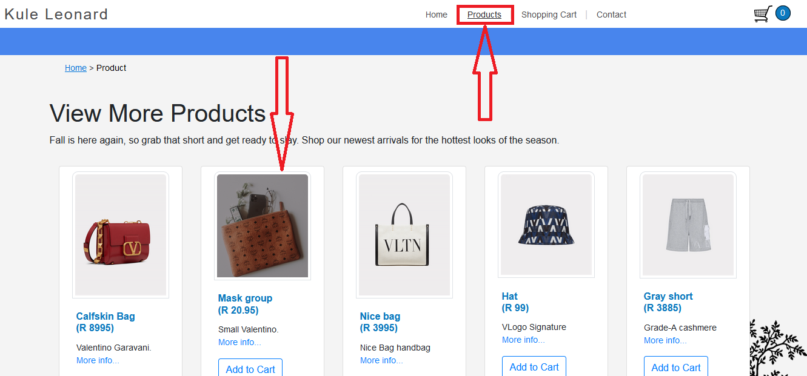
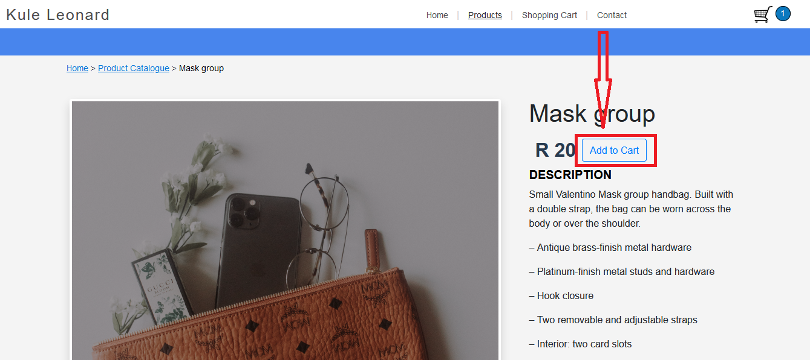
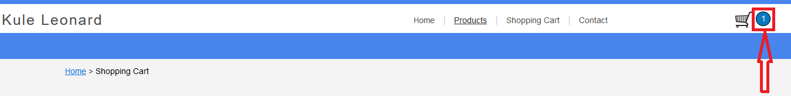
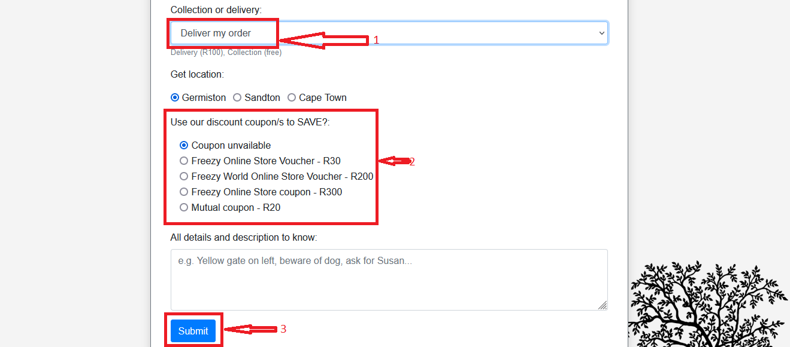
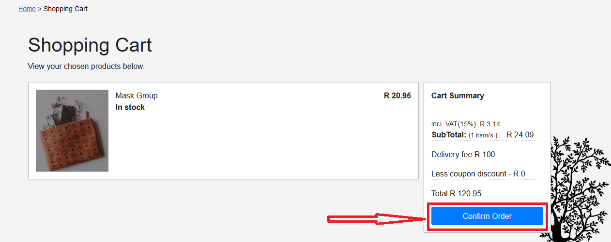

# Online Store - Capstone Project 2 - Level 1

## Description
Functional shopping cart for online store using Bootstrap, HTML, CSS, Javascript and Jquery which allows users to quickly add to cart from the catalogue page. The user will see what is in their cart, each item’s price, and calculating the total cost with adding VAT. This has to allow use of discount coupons witha form that allows selection of collection or delivery option.This will also alert the user with a successful message for order confirmation

## Table of Contents
* [Instructions](#instructions)
* [Technologies](#technologies)
* [Installation](#installation)
* [Usage](#usage)
* [Credits](#credits)

## Instructions
Below are the instruction given to create the project as stated by task 15 level 1. 

**Note: Feel free to reuse any work you have already done for this project. Your online store is required to implement the following:**

* Within the entirety of your site, you should have the following JavaScript functionality:
    * Create a functional shopping cart for your online store.
    * Allow a “quick add to cart” from the catalogue page.
    * Each product’s page must also have the option to “add to cart”.
    * When an item is added, an alert should tell the user what the current total is.
    * Create a new html page for the cart section which allows the user to see what is in their cart, each item’s price, and the total cost (remember to add VAT!)
    * Create a form which allows for “discount coupons”.
    * Create forms to allow a user to select “collection” or “delivery”.
    * Create forms for different delivery options.
    * Your total should change based on what delivery option is chosen and if a certain coupon is applied.
    * Create a “confirm order” button which alerts the user that their order was successful and generates them a reference number (keyword: generate)
    * Within the entirety of your site, you should have at least the following jQuery functionality:
        * A function which contains hiding/showing.
        * A drop-down menu.
        * Animation effects.
        * A function with chained effects.

### Technologies
This project uses:
* HTML 5 
* CSS 3
* Javascript ECMAScript 2021
* Bootstrap 4
* jQuery 3.6.0

## Installation
All  codes for this project can be found here if would like to view my GitHub repository for the project - [Capstone Project 2](https://github.com/kuleleonard/Capstone-project/). To clone this respository to your local machine, use the following URL's: 
[SSH](git@github.com:kuleleonard/Capstone-project.git) or [HTTPS](https://github.com/kuleleonard/Capstone-project.git) . If you want to Learn how to clone a Git repository, go to [Cloning a Repository](https://docs.github.com/en/repositories/creating-and-managing-repositories/cloning-a-repository) .

## Usage
To use this website, simply follow the instructions below (includes screenshots):

### Step 1
Click on the "Products" link at the top right of the website to view the available products. Then click on the image of the product you would like to add to the "shopping cart". See figure 1 below.

### Step 2
Click the "Add to Cart" button for the product you have selected. See figure 2 below.

### Step 3
Click the "Go to cart" button that appears next to the "Add to cart" button. See figure 3 below.

### Step 4
Click the "Proceed to Shipping" button under the "Cart Summary" information. See figure 4 below.

### Step 5
Fill in the form, including whether you want to have your product delivered (1) or you will collect it, and choose a discount coupon (2), if applicable. Once you have filled all your information in, click the "Submit" button at the bottom (3). See figure 5 below.

### Step 6
Finally, you can click the "Confirm order" button on the Shopping cart page to finalise your order. See figure 6 below.

### Credits
This website was created by Evan Malherbe during the HyperionDev Full Stack Web Development Bootcamp November 2021 [GitHub profile](https://github.com/kuleleonard) 
